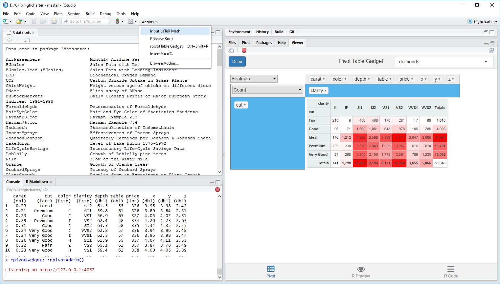

## rpivotGadget:  RStudio add-in for rpivotTable

This package provide an RStudio add-in wrapper around the [rpivotTable](https://github.com/smartinsightsfromdata/rpivotTable) HTML widget based on [Nicolas Kruchten's pivotTable.js](https://github.com/nicolaskruchten/pivottable).



### Features

- Wraps the excellent [smartinsightsfromdata](https://github.com/smartinsightsfromdata) HTML widget so that it can be accessed from the RStudio add-in menu and assigned a hot key
- Dropdown box to select R dataframe
- Experimental attempt to replicate the pivotTable.js c3.js in R/dplyr/ggplot

### Installation

```R
install.packages(c("shiny","miniUI","rstudioapi","ggplot2","dplyr","shinyAce","whisker","tidyr","DT","rpivotTable"))
devtools::install_github("dkilfoyle/rpivotGadget")
```

Currently depends on a custom version of MiniUI due to a [bug](https://github.com/rstudio/miniUI/issues/5) in the tabStrip. It will still work without this but you will need to click in the ACE editor before the text will update. This does not effect the pivot table function. 

**update 4/4/16** Now using a javascript hack so you can use the standard CRAN MiniUI

### Useage

- Make sure you have a dataframe on the global environment eg data(iris)
- Select rpivotGadget from RStudio addins menu (or assign a keyboard shortcut)
